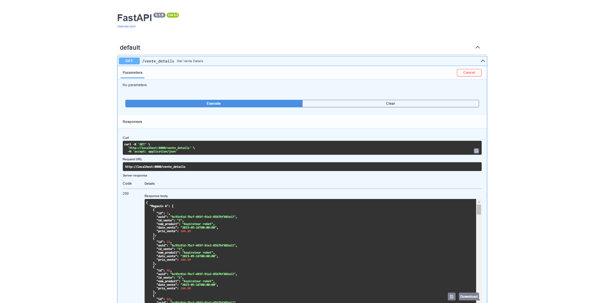

# Airflow self-training by example
* The purpose of this repo is to try to help, many thanks to the Apache Airflow community

## Installation of your **python 3.10** development environment
* Read to understand python virtualenv (https://blog.stephane-robert.info/post/python-pyenv-pipenv/)
* Pyenv has been installed (**we can continue**)
* Suite of commands to adapt according to your organization (your python env linked to a python version, and a dev directory for our test)
```console
pyenv virtualenv <my_env_dev>
pyenv activate <my_env_dev>
cd ~
mkdir <my_src_dev>
cd <my_src_dev>
```

## AirFlow an OpenSource workflow management

### Preparation
* Product URL (https://airflow.apache.org/)
* Install github project in your python env (https://github.com/pahpa/airflow-study)
```console
git clone https://github.com/pahpa/airflow-study
cd aiflow-study
pip install -r requirements-dev.txt
```
* Creation and initialization of the database + addition of user admin
```
airflow db init
airflow users  create --role Admin --username admin --email admin --firstname admin --lastname admin --password admin
```
* A username/password will be assigned to you
> Login web local (username: **admin**  password: **admin**)
* airflow will be installed in ~/airflow
* If you want to change the TimeZone modify in ~/airflow/airflow.cfg **default_timezone = Europe/Paris**
```
sed -i 's/default_ui_timezone = UTC/default_ui_timezone = Europe\/Paris/' ~/airflow/airflow.cfg
```
* If you don't want the AirFlow examples edit in ~/airflow/airflow.cfg **load_examples = False**
```
sed -i 's/load_examples = True/load_examples = False/' ~/airflow/airflow.cfg
```
* Preparation of test files
```console
mkdir -p ~/airflow/dags
cp selling_aggreg.py ~/airflow/dags
cp wait*.py ~/airflow/dags
cp expected.csv /var/tmp
```
* Launch Airflow servers
```console
airflow webserver --port 8080 -D
airflow scheduler -D
```
* To kill daemon processes
```console
kill $(cat ~/airflow/*.pid)
rm ~/airflow/*.pid
```


### Execute a workflow
* Workflow list check
```
airflow dags list
```
* Immediate execution of the selling_aggreg workflow
```
airflow dags trigger selling_aggreg
```

## HTTP API in flask for the selling_aggreg task
* Local API server launch (Python Flask https://flask.palletsprojects.com/)
```console
flask --app mini_serv run -h 0.0.0.0 -p 8181 --debug --reload
```
* Using request get info for a store
[Info Store B](http://localhost:8181/store/Store%20B)

* Use curl in 15s loop to see status of aggregations
```console
while true; do curl -s http://localhost:8181/sell_aggreg; sleep 15; done
```

## AirFlow integration master/details
* Objective to integrate the csv sales.csv using the sales table (master) and vente_details (details)
* An automatic creation of the store will be made in sale
* An integration per line will be made in vente_details and attached to the store (sale)
* I did not set up an accumulation of sales by article but just to show how to do relational
* Instant execution of the sales_integration workflow
```
airflow dags trigger ventes_integration
```

## HTTP API in FastAPI for the sales_integration task
* Launch local API server (Python FastAPI https://fastapi.tiangolo.com/)
```
uvicorn mini_serv2:app --reload
```
* You have integrated swagger access to FastAPI
http://localhost:8000/docs


