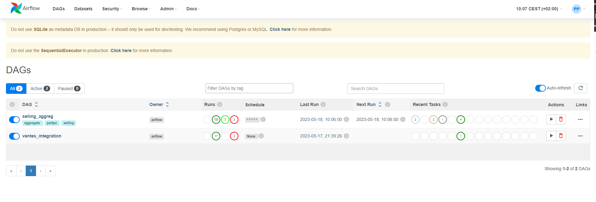

# Autoformation à Airflow par l'exemple
* L'objectif de ce repo est d'essayer d'aider, un grand merci à la communauté Apache Airflow

## Installation de votre environnement **python 3.10** de développement
* A lire pour comprendre le virtualenv python (https://blog.stephane-robert.info/post/python-pyenv-pipenv/)
* Pyenv a été installé (**on peut continuer**)
* Suite de commandes à adapter selon votre organisation (votre env python lié à une version python, et un répertoire de dev pour notre test)
```console
pyenv virtualenv <my_env_dev>
pyenv activate <my_env_dev>
cd ~
mkdir <my_src_dev>
cd <my_src_dev>
```

## AirFlow une gestion de workflow OpenSource

### Préparation
* Url du produit (https://airflow.apache.org/)
* Installation du projet github dans votre env python (https://github.com/pahpa/airflow-study)
```console
git clone https://github.com/pahpa/airflow-study
cd aiflow-study
pip install -r requirements-dev.txt
```
* Création et initialisation de la base de données + ajout user admin
```
airflow db init
airflow users  create --role Admin --username admin --email admin --firstname admin --lastname admin --password admin
```
* Un username/password vous sera affecté
> Login web local (username: **admin**  password: **admin**)
* airflow sera installé dans ~/airflow 
* Si vous voulez changer le TimeZone modifiez dans ~/airflow/airflow.cfg **default_timezone = Europe/Paris**
```
sed -i 's/default_ui_timezone = UTC/default_ui_timezone = Europe\/Paris/' ~/airflow/airflow.cfg
```
* Si vous ne voulez pas les exemples AirFlow modifiez dans ~/airflow/airflow.cfg **load_examples = False**
```
sed -i 's/load_examples = True/load_examples = False/' ~/airflow/airflow.cfg
```
* Préparation des fichiers de tests
```console
mkdir -p ~/airflow/dags
cp selling_aggreg.py ~/airflow/dags
cp vente*.py ~/airflow/dags
cp ventes.csv /var/tmp
```
* Lancement serveurs Airflow
```console
airflow webserver --port 8080 -D
airflow scheduler -D
```
* Pour tuer les process deamon
```console
kill $(cat ~/airflow/*.pid)
rm ~/airflow/*.pid
```


### Test d'un workflow
* Test tache Airflow (selling_aggreg)
 * Vérification de la liste des workflows
 ```
 airflow dags list
 ```
 * Exécution instant du workflow selling_aggreg
 ```
 airflow dags trigger selling_aggreg
 ```

## API http en flask pour la tache selling_aggreg
* Lancement serveur API local (Python Flask https://flask.palletsprojects.com/)
```console
flask --app mini_serv run -h 0.0.0.0 -p 8181 --debug --reload
```
* Utilisation request get info pour un magasin
[Info Magasin B](http://localhost:8181/magasin/Magasin%20B)

* Utilisation curl en boucle 15s pour voir l'état des agrégations
```console
while true; do curl -s http://localhost:8181/sell_aggreg; sleep 15; done
```

## AirFlow integration master/details
* Objectif intégrer le csv ventes.csv en utilisant la table vente (master) et vente_details (details)
    * Une création automatique du magasin sera faite dans vente
    * Une intégration par ligne sera faite dans vente_details et rattachée au magasin (vente)
    * Je n'ai pas mis en place un cumul de vente par article mais juste monter comment faire du relationnel
* Exécution instant du workflow ventes_integration
```
airflow dags trigger ventes_integration
```

## API http en FastAPI pour la tache ventes_integration
* Lancement serveur API local (Python FastAPI https://fastapi.tiangolo.com/)
```
uvicorn mini_serv2:app --reload
```
* Vous avez un acces swagger intégré a FastAPI
http://localhost:8000/docs


